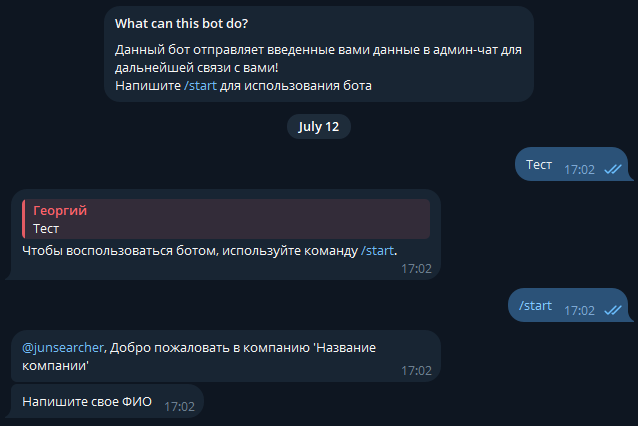

# Regestration Telegram Bot

*Telegram bot* предназначен для обработки заявок клиента и передачи их в *admin-chat*.

*P.S.
    Данный telegram bot был разработан мной, как тестовое задание для одной IT компании. Это был мой первый опыт в создании telegram bot'ов.*


## Визуализация работы программы

### Обработка комманды ```/start```


### Проверка ФИО


### Проверка номера телефона

Имеется два варианта ввода номера телефона.
1. При помощи кнопки
   
   В данном случае будет использован номер телефона, который привязан к вашему *telegram* аккаунту. Проверка на корректность введенных данных **не выполняется**.

    
2. При помощи текста
   
   Такой вариант удобен, если вы хотите ввести другой номер телефона. Проверка на корректность введенных данных **выполняется**.

    

### Комментарий


### Ознакомление с вводными положениями

В данном разделе прикрепляется *pdf* файл, в котором расписаны основные положения компании.


Далее пользователю предоставляется кнопка, на которой написано "Да". В случае, если пользователь не нажимает на кнопку и вводит что-либо, кроме слова "Да", ему высвечивается просьба "Ознакомиться с вводными положениями".

*P.S. Также согласиться можно не нажимая на кнопку, указав слово "Да" в любом регистре.*


### Завершение регистрации

В случае успешной регистрации высвечивается сообщение "Спасибо за успешную регистрацию" + изображение.


### Отправление данных в *admin* чат

После успешного прохождения регистрации, сообщение отправляется в *admin* чат в следующем виде:


### Как это выглядит в чатах?


## Версии библиотек

В данном боте используется следующие сторонние библиотеки:
+ **aiogram** (version 3.10.0) — *Данная библиотека предназначена для работы с ботами в telegram*
+ **python-dotenv** (version 1.0.1) — *Данная библиотека предназначена для защищенного хранения ваших TOKEN'ов*


## Объяснение по установке

### 1. Создание виртуального окружения и установка библиотек

Данный пункт **не обязательный**, однако так вы сможете установить нужные версии библиотек **отдельно** от основной системы.

```
python -m venv .venv
```
*.venv — название виртуального окружения*

```
.venv\Scripts\activate
```

*Данная комманда перенаправит вас в виртуальное окружение*


```
pip install aiogram==3.10.0
```

```
pip install python-dotenv==1.0.1
```

*Данные комманды установят библиотеки*

### 2. Создание файла .env

Этот файл нужен для защищенного хранения *API_TOKEN* и *ADMIN_CHAT_ID*.

В файле **.env** вам нужно будет прописать следующее:

```
API_TOKEN = (ваш api token)
ADMIN_CHAT_ID = (ваш @admin_chat_id)
```

1. *API_TOKEN* можно получить у официального *telegram* бота https://t.me/BotFather

    Вам нужно написать /newbot и далее следовать инструкции, после чего бот выдаст вам следующее сообщение:


2. *ADMIN_CHAT_ID*. Для его получения вам нужно создать чат в telegram.

*P.S. Вам нужно добавить бота в этот telegram чат, иначе данные не будут отправляться туда.*


*P.S. Описание, картинка, имя бота и т.д. настраиваются **вручную***

### 3. Запуск *telegram* бота.

Запуск можно осуществлять как локально на вашем ПК, так и загрузив бота на *server*. **Мы рассмотрим локальный запуск бота.**

Пропишите в консоль команду:

```
python bot.py
```

:heavy_check_mark: После выполнения этих комманд можно начинать пользоваться ботом.

### 4. Выключение *telegram* бота.

Для выключения бота нужно нажать в консоле следующую комбинацию клавиш:

```
Ctrl + C
```

После чего вы получите следующее сообщение в консоле:

```
Бот выключен
```